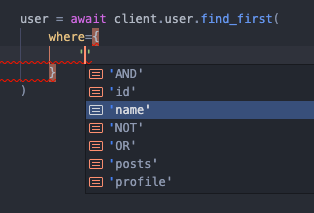

# Editor

Prisma Client Python makes use of fairly new additions to the python language, this means that some IDEs / editors will have sub-optimal support for certain features.

## VSCode

It is _highly_ recommended to install [pylance](https://marketplace.visualstudio.com/items?itemName=ms-python.vscode-pylance) v2021.9.4 or higher as this extension adds support for auto-completing Prisma Client Python's query arguments, for example:

TODO: Prisma.Prisma extension too

## Sublime Text

TODO: pyright extension

https://packagecontrol.io/packages/Prisma
